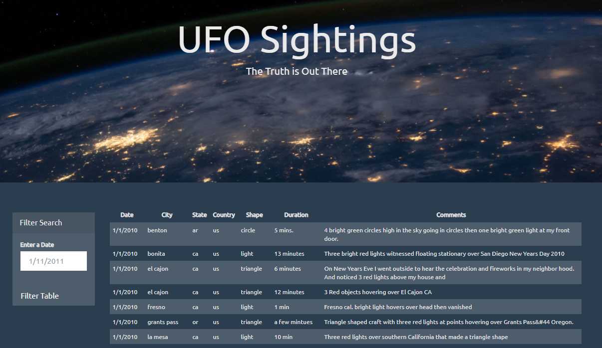
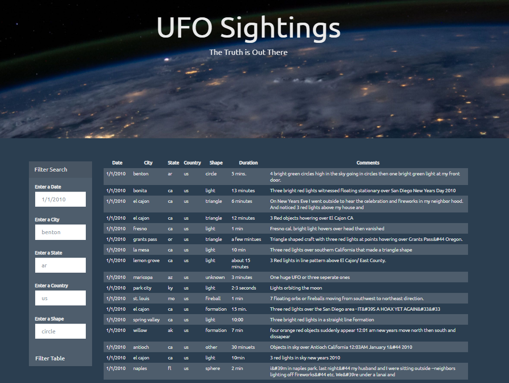

#### javascript-challenge
Intro to JavaScript Homework - Data Bootcamp UofO

## Background

WAKE UP SHEEPLE! The extra-terrestrial menace has come to Earth and they at `ALIENS-R-REAL` have collected all of the eye-witness reports they could to prove it! All they needed to do is to put this information online for the world to see and then the matter will finally be put to rest.

There is just one tiny problem though... their collection is too large to search through manually. Even their most dedicated followers are complaining that they are having trouble locating specific reports in this mess.

That's why they hired me. They needed me to write code that created a table dynamically based upon a [dataset they provided](StarterCode/static/js/data.js). They also needed to allow their users to filter the table data for specific values. There was a catch though... they only use pure JavaScript, HTML, and CSS, and D3.js on thier web pages. Those are the only coding languages which can be trusted, as I was told.

The planet Earth needs to know what we have found! Panic is never good. "Don't Panic. Always bring a towel."

### Level 1: Automatic Table and Date Search

* I used the basic HTML web page that was provided.

* Using the UFO dataset provided in the form of an array of JavaScript objects, I wrote code that appends a table to the web page and then adds new rows of data for each UFO sighting.

  * I made sure to have a column for `date/time`, `city`, `state`, `country`, `shape`, and `comment` at the very least.

* I used a date form in my HTML document and wrote JavaScript code that will listen for events and search through the `date/time` column to find rows that match user input.

### Level 2: Multiple Search Categories

* I completed all of Level 1 criteria (essentially copied and pasted).

* I then used multiple `input` tags, wrote JavaScript code so the user can to set multiple filters and search for UFO sightings using the following criteria based on the table columns:

  1. `date/time`
  2. `city`
  3. `state`
  4. `country`
  5. `shape`

- - -

### Dataset

* [UFO Sightings Data](UFO-level-1/static/js/data.js)

- - -

### Additional Notations

The table is generated without any selection for the filter. The filter selection for Level-1 has only one option but Level-2 has multiple selections. Level-2 filter can be either one of the 5 options or in tandem with any or all of the 5.

- - -
